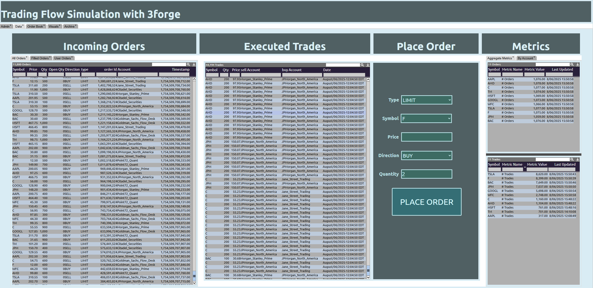

# 3forge-project

## Project Description

This project simulates a financial trading environment using [3forge's AMI](https://www.3forge.com/) platform. It models live stock order flow using asset-specific volatility, customizable simulation speeds, and integrates with AMI's client and center APIs.

---

## Folder Structure

```
3forge-project/
├── src/                  # Java source code
│   ├── CenterClient.java
│   ├── SimulationRunner.java
├── config/               # JSON stock/asset config files
│   └── stocks_asset_class.json
├── lib/                  # External JARs from 3forge + utilities
├── classes/              # Compiled output classes
│   matchingEngine/   # Matching engine and order logic
│   └── 
├── run_center_client.bat # Launch script for Windows
├── .gitignore
└── README.md
```

---

## Requirements

- Java JDK 11 or higher
- 3forge-provided `.jar` files:
  - `out.jar`
  - `autocode.jar`
  - `json-*.jar`

---

## Setup Instructions

1. **Verify Java Installation**
   ```bash
   java -version
   javac -version
   ```

3. **Place Dependencies**
   - Copy all required `.jar` files (from 3forge) into the `lib/` folder.

4. **Configure JSON**
   - Add asset definitions to `config/basic_sim.json`:
     ```json
     [
       { "symbol": "AAPL", "assetClass": "Equity", "midPrice": 170.5 },
       { "symbol": "BTC", "assetClass": "Crypto", "midPrice": 28000 }
     ]
     ```

5. **Edit Simulation Settings**
   - Open `SimulationRunner.java` and comment/uncomment asset classes and set simulation speed. NOTE: the rate at which executed trades are sent to AMI is constant, as this is just for visualization purposes.

---

## Running the Simulation

### Windows
Double-click or run from terminal:
```bash
.
un_center_client.bat
```

### Manual (CLI)
```bash
javac -d classes -cp "lib/*" src/*.java src/matchingEngine/*.java
java -cp "classes;lib/*" SimulationRunner config/stocks_asset_class.json demo 3289 3270
```

---

## Features

- Custom asset class selection
- Per-asset-class volatility control
- Adjustable order simulation frequency
- Streaming order execution updates to AMI
- Matching engine per stock symbol
- Logs executions to console

---

## Output Format

AMI `simpleMD` message includes:
- Symbol
- LastTradeTimestamp
- Price
- Order Type (Limit/Market)

---

## Tips

- Modify `SimulationRunner.java` to change behavior (e.g. asset selection, volatility map, simulation speed)
- JSON format must include `"assetClass"` and `"midPrice"` for each symbol
- Use `System.out.println()` to debug or monitor live trading logic

---

## Contact

For internal 3forge/academic usage:  
Devon Knox  
devon.knox@3forge.com or devon.knox@duke.edu
